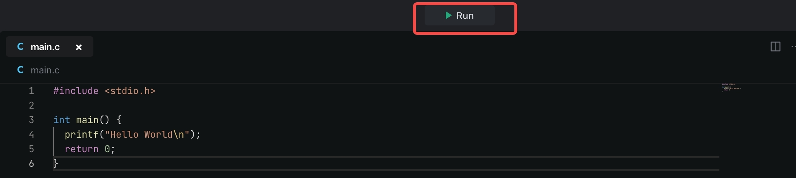
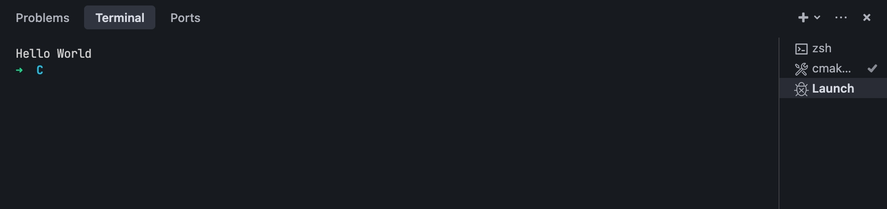

# Introduction
Template for C "Hello World!" project.

# Get started
- Click the **Run** button to run the program.
  
- Go to the Terminal panel to view the output.
  

By default, MarsCode run with default **CMakeLists** and **.vscode/launch.json** configuration files, which you can modify to customize the configuration. Refer to [Visual Studio Code's doc](https://code.visualstudio.com/docs/editor/debugging) for how to configure launch.json.

# Learn more
- [cprogramming](https://www.cprogramming.com/) - learn C and C++ programming
- [makefile](https://makefiletutorial.com/) - makefile tutorial
- [cmake](https://cmake.org/cmake/help/latest/guide/tutorial/) - cmake tutorial

# Help
If you need help, you might be able to find an answer in our [docs](https://docs.marscode.com/). Feel free to report bugs and give us feedback [here](https://discord.gg/qtVMXEDbRw).