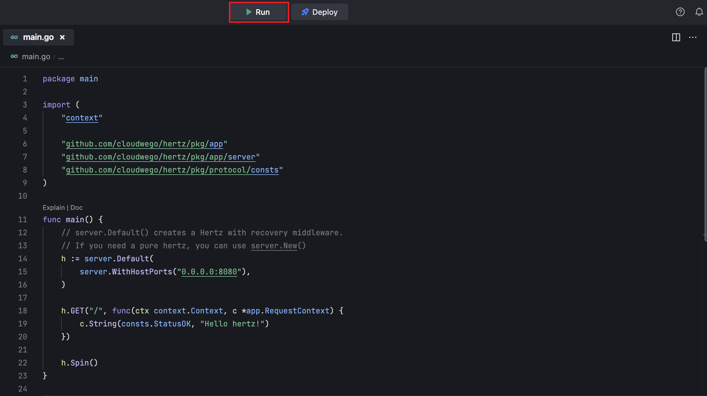
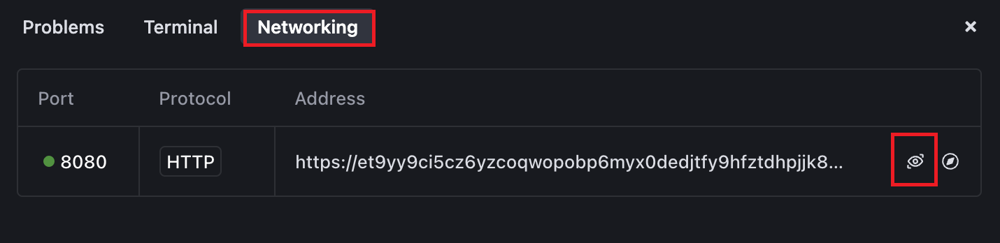
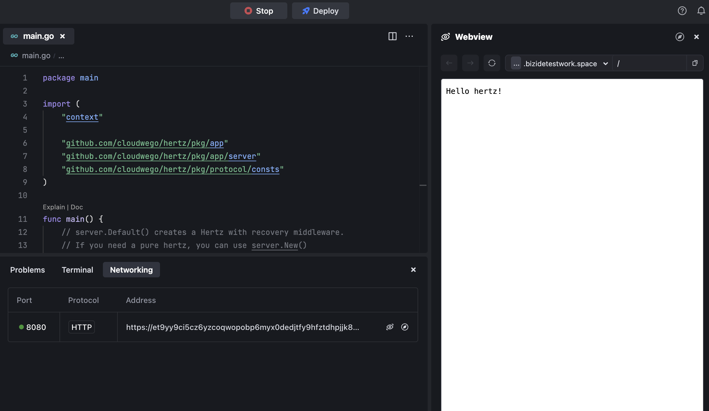

# Introduction

This example demonstrates how to use Hertz with the Golang Runtime.

# Get started

- Click the **Run** button to run the program.
  
- Go to **Networking** adn preview the page at **port:8080**
  
- Got to **Preview** and watch it.
  

By default, MarsCode provide you with a default running configuration, you can modify it in the **.vscode/launch.json**. Refer to [Visual Studio Code's doc](https://code.visualstudio.com/docs/editor/debugging) for how to configure launch.json.

# Learn More

- [Golang](https://go.dev/learn/) - learn about Golang features.
- [Hertz](https://www.cloudwego.io/docs/hertz/) - learn about Hertz features.

# Help

If you need help, you might be able to find an answer in our [docs](https://docs.marscode.com/). Feel free to report bugs and give us feedback [here](https://discord.gg/qtVMXEDbRw).
