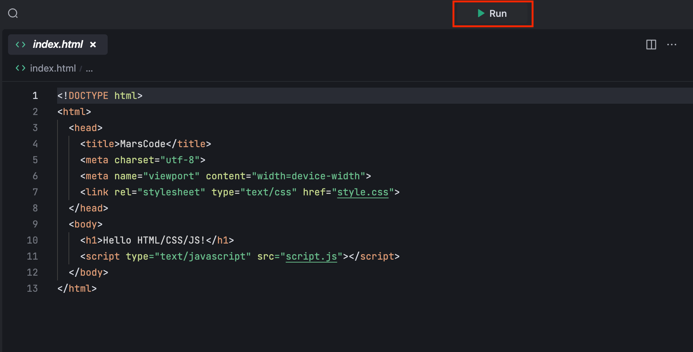
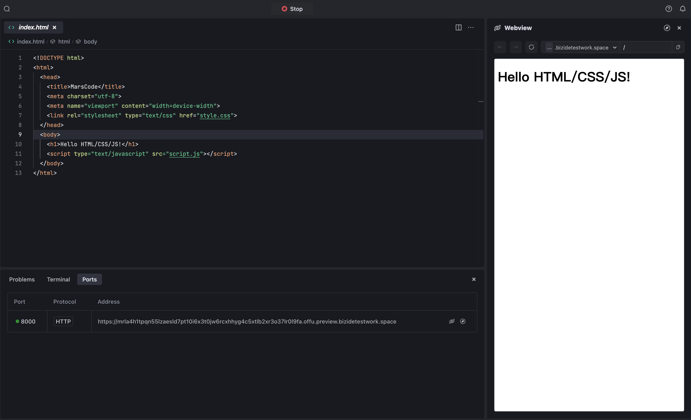

# Introduction
Template for HTML/CSS/JS project.

# Get started

- Click the **Run** button to run the project.

- Go to **Preview** and watch it live update.

By default, MarsCode provide you with a default running configuration, you can modify it in the **.vscode/launch.json**. Refer to [Visual Studio Code's doc](https://code.visualstudio.com/docs/editor/debugging) for how to configure launch.json.

# Help
If you need help, you might be able to find an answer in our [docs](https://docs.marscode.com/). Feel free to report bugs and give us feedback [here](https://discord.gg/qtVMXEDbRw).