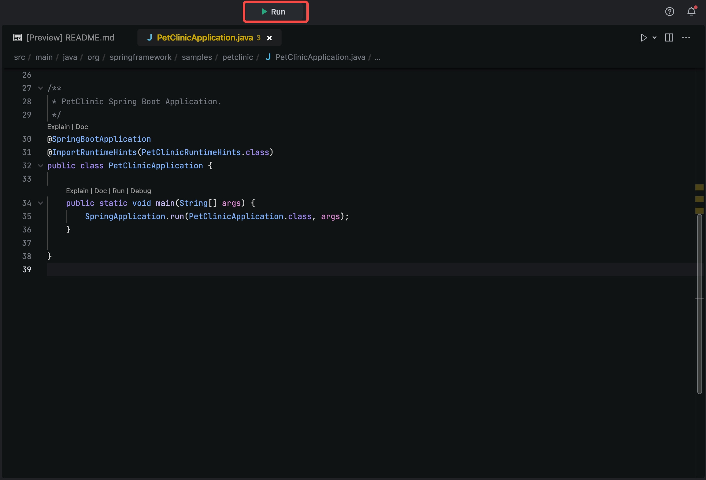
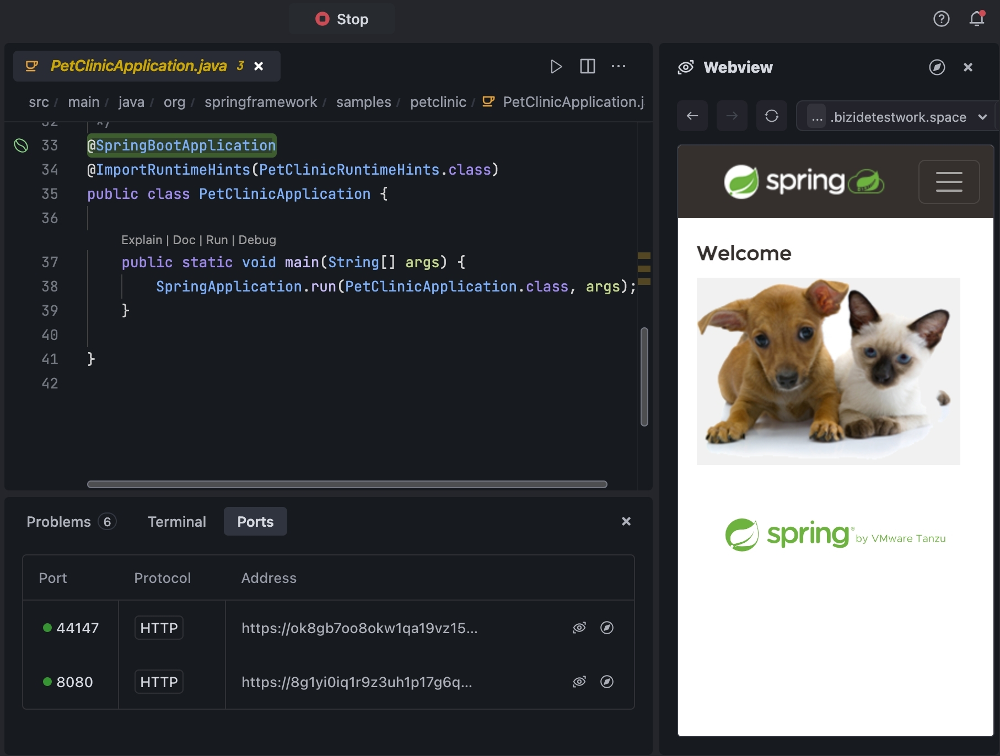

# Introduction
This templates demonstrates how to use Spring with java runtime.

# Get started
* Click the **Run** button to run the project.

* Go to **Ports** and preview the page at **port:8080**.

* Go to **Preview** and watch it live update.

By default, MarsCode runs the **PetClinicApplication**, but you can configure it by changing the configuration in the **.vscode/launch.json**. Refer to [Visual Studio Code's doc](https://code.visualstudio.com/docs/editor/debugging) for how to configure launch.json.

# Learn more
- [java](https://dev.java/learn/) - learn about Java programming.
- [SpringBoot](https://spring.io/projects/spring-boot) - learn about Spring Boot features.
- [Spring PetClinic Sample Application](https://github.com/spring-projects/spring-petclinic) - learn about Spring PetClinic Sample Application.

# Help
If you need help, you might be able to find an answer in our [docs](https://docs.marscode.com/). Feel free to report bugs and give us feedback [here](https://discord.gg/qtVMXEDbRw).