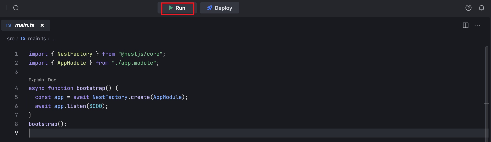
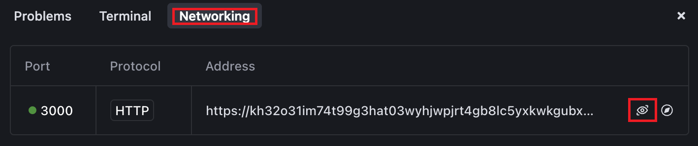
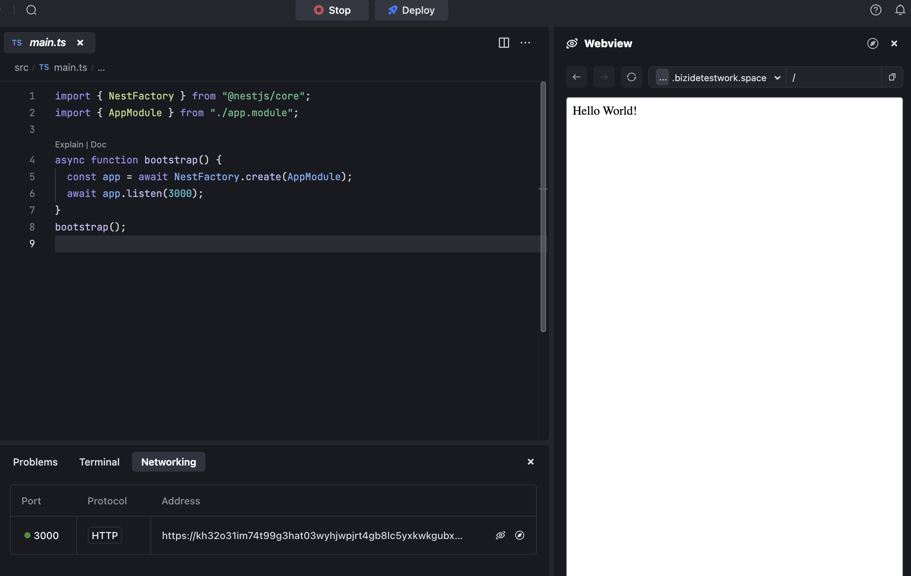

# Introduction
This example demonstrates how to use Nest with the Node.js Runtime.

# Get started
- Click the **Run** button to run the program.
  
- Go to **Networking** adn preview the page at **port:3000**
  
- Got to **Preview** and watch it.
  

By default, MarsCode provide you with a default running configuration, you can modify it in the **.vscode/launch.json**. Refer to [Visual Studio Code's doc](https://code.visualstudio.com/docs/editor/debugging) for how to configure launch.json.

# Learn more
To learn more about Node.js and Nest, refer to the following resources:
- [introduction-to-nodejs](https://nodejs.org/en/learn/getting-started/introduction-to-nodejs) - learn about Node.js features.
- [Nest](https://nestjs.com/) - learn about Nest features.

# Help
If you need help, you might be able to find an answer in our [docs](https://docs.marscode.com/). Feel free to report bugs and give us feedback [here](https://discord.gg/qtVMXEDbRw).