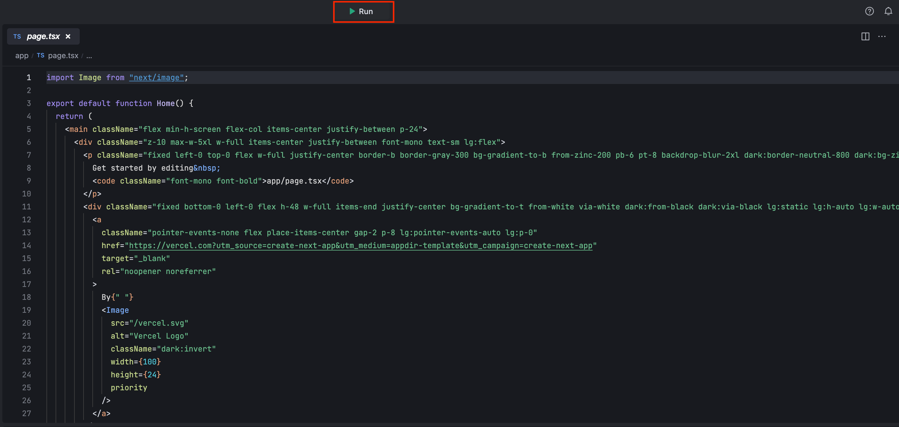
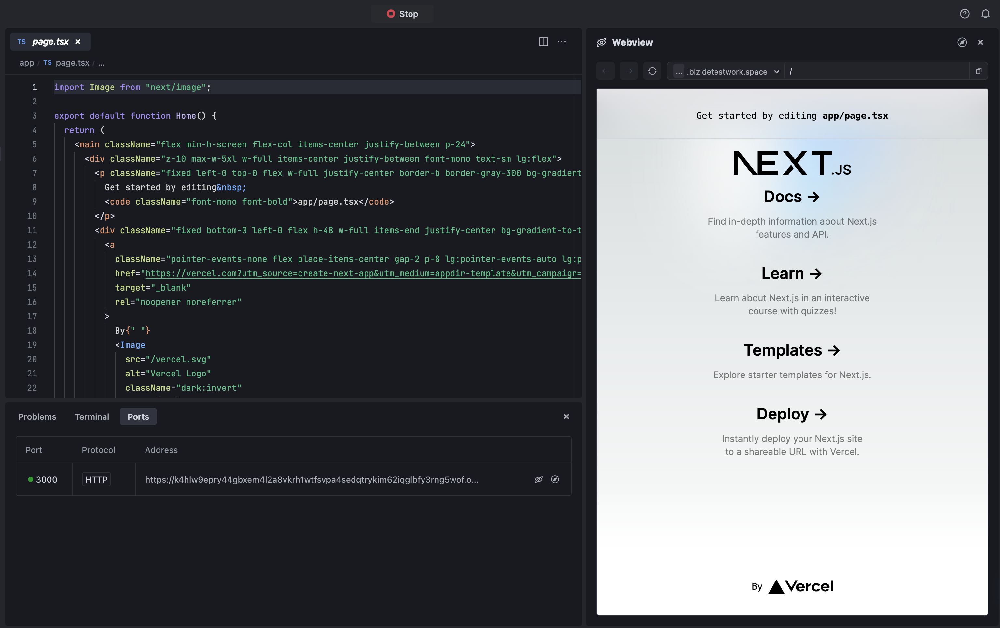

# 简介
这是一个用 ["create-next-app"](https://github.com/vercel/next.js/tree/canary/packages/create-next-app) 的[Next.js](https://nextjs.org/) 项目，使用 ["next/font"](https://nextjs.org/docs/basic-features/font-optimization) 自动优化，以及加载自定义Google字体Inter。
# 开始吧
* 单击 **运行** 按钮启动程序。

   

* 转到 **预览** 并观看实时更新。

   

默认情况下，MarsCode运行 **开始** 脚本，你可以更改 **. vscode/launch.json** 中的配置。参考 [Visual Studio Code的文档](https://code.visualstudio.com/docs/editor/debugging) 有关如何配置launch. json。
## 了解更多
- [Next. js文档](https://nextjs.org/docs) -了解Next. js的功能和API。
- [学习Next. js](https://nextjs.org/learn) -交互式Next. js教程。
# 帮助
如果你需要帮助，你可以查看[文档](https://docs.marscode.cn/)，或向我们提供[反馈](https://juejin.cn/pin/club/7359094304150650889?utm_source=doc&utm_medium=marscode)。

