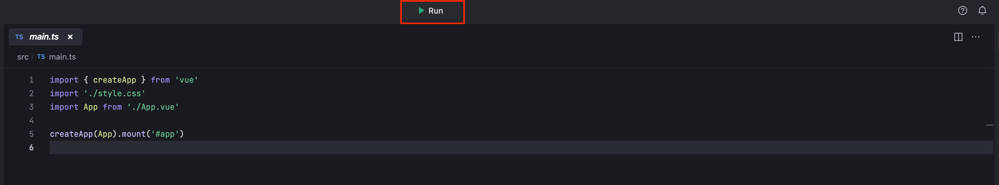
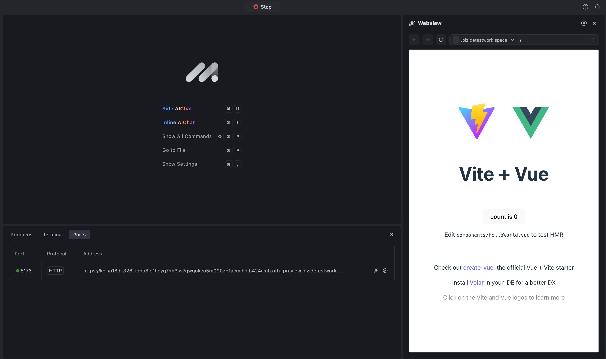

# Introduction
This template aims to help get you started on developing with Vue 3 and TypeScript. The template uses Vue 3 `<script setup>` SFCs, check out the [script setup docs](https://v3.vuejs.org/api/sfc-script-setup.html#sfc-script-setup) to learn more information.

# Get started
* Click the **Run** button to run the project.

* Go to **Preview** and watch it live update.

By default, MarsCode runs the **start** script, but you can configure it by changing the configuration in the **.vscode/launch.json**. Refer to [Visual Studio Code's doc](https://code.visualstudio.com/docs/editor/debugging) for how to configure launch.json.

# Learn more
To learn more about Vue, take a look at the following resources:
- [VUE](https://vuejs.org/) - learn about Vue features.
- [VITE](https://vitejs.dev/)- learn about VITE features.

# Help
If you need help, you might be able to find an answer in our [docs](https://docs.marscode.com/). Feel free to report bugs and give us feedback [here](https://discord.gg/qtVMXEDbRw).