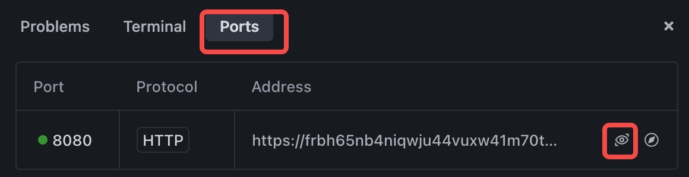
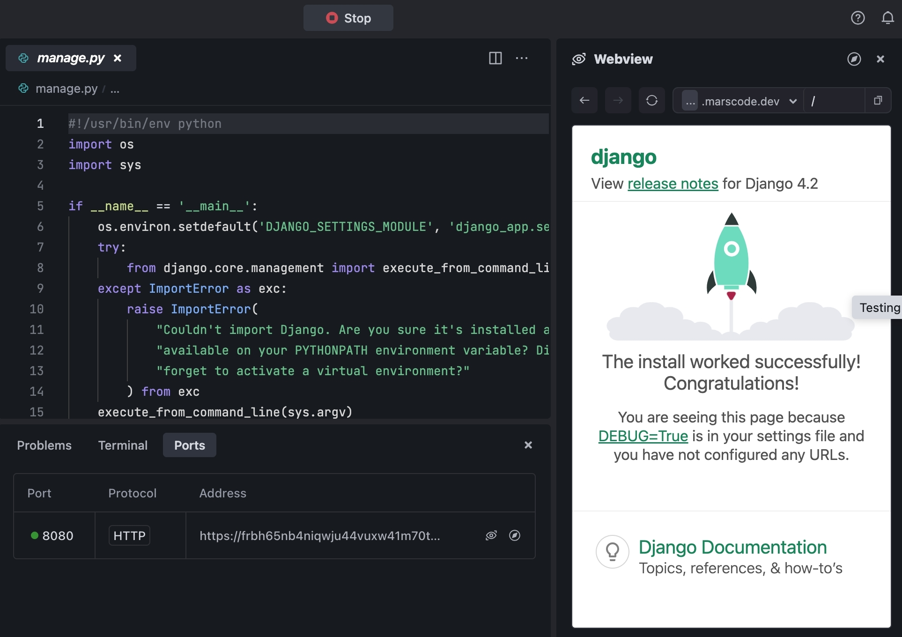

# 简介
此模板介绍如何将 Django 与 Python 一起使用。
# 开始
* 单击 **运行** 按钮启动程序。

* 转到 端口 并预览页面 **端口：8080。**

   

* 转到 Webview 查看实时页面。

   

默认情况下，MarsCode运行 **manage.py**，你可以更改 **. vscode/launch.json** 中的配置。参考 [Visual Studio Code的文档](https://code.visualstudio.com/docs/editor/debugging) 有关如何配置launch. json。
# 了解更多
- [Python](https://www.python.org/) -Python编程语言的官方主页。
- [Django](https://www.djangoproject.com/) -了解Django功能。
# 帮助
如果你需要帮助，你可以查看[文档](https://docs.marscode.cn/)，或向我们提供[反馈](https://juejin.cn/pin/club/7359094304150650889?utm_source=doc&utm_medium=marscode)。

