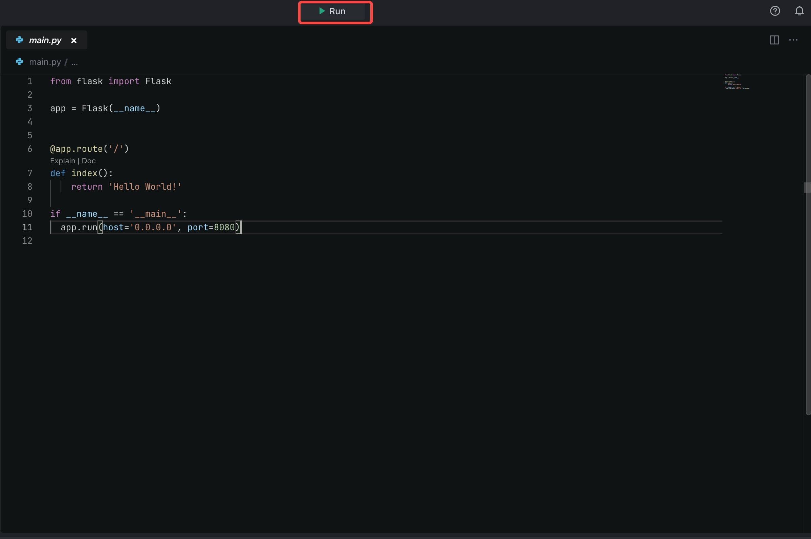
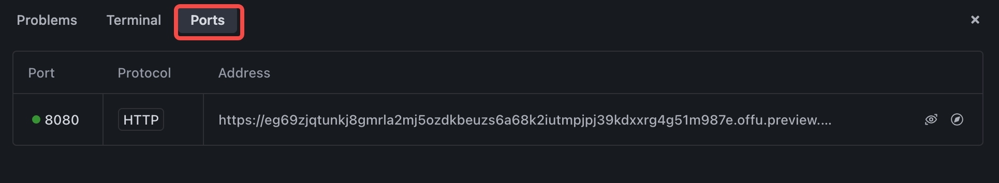
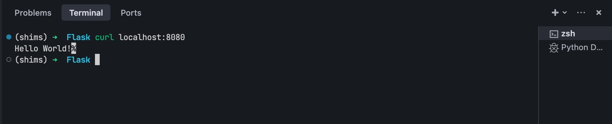

# Introduction
This templates demonstrates how to use flask & gunicorn with python runtime.

# Get started
* Click the **Run** button to run the project.

* Go to **Ports** and preview the page at **port:8080**.

* Go to **Terminal** and Execute the "curl localhost:8080" command.

By default, MarsCode runs the **Flask** By **Gunicorn**, but you can configure it by changing the configuration in the **.vscode/launch.json**. Refer to [Visual Studio Code's doc](https://code.visualstudio.com/docs/editor/debugging) for how to configure launch.json.

# Learn more
- [Python](https://www.python.org/) - tThe official home of the Python programming language.
- [Flask](https://flask.palletsprojects.com/en/3.0.x/) - learn about Flask features.
- [Gunicorn](https://gunicorn.org/) - learn about Gunicorn features.

# Help
If you need help, you might be able to find an answer in our [docs](https://docs.marscode.com/). Feel free to report bugs and give us feedback [here](https://discord.gg/qtVMXEDbRw).