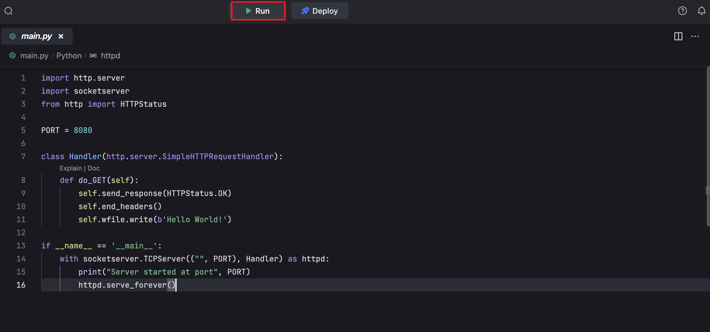
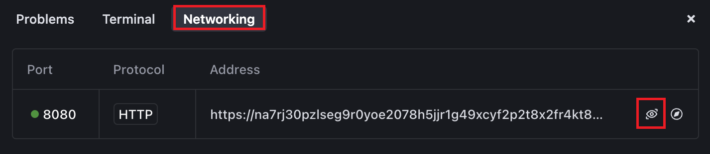
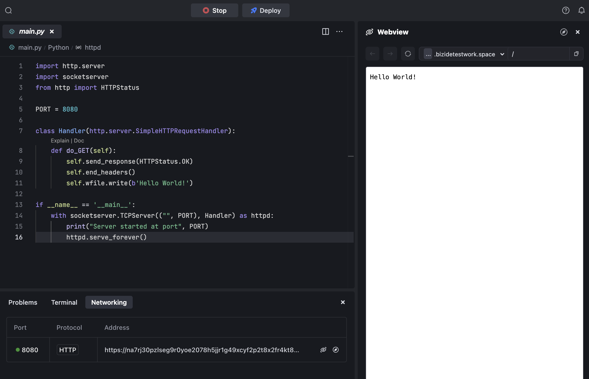

# Introduction

Template for Python HTTP server project.

# Get started

- Click the **Run** button to run the project.
  

* Go to **Ports** and preview the page at **port:8080**.
  

* Go to **Preview** and watch it.
  

By default, MarsCode provide you with a default running configuration, running main.py. You can modify it in the **.vscode/launch.json**. Refer to [Visual Studio Code's doc](https://code.visualstudio.com/docs/editor/debugging) for how to configure launch.json.

# Learn more

- [Python](https://www.python.org/) - the official home of the Python programming language.

# Help

If you need help, you might be able to find an answer in our [docs](https://docs.marscode.com/). Feel free to report bugs and give us feedback [here](https://discord.gg/qtVMXEDbRw).
