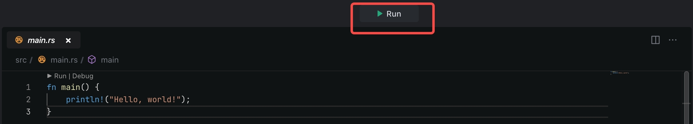
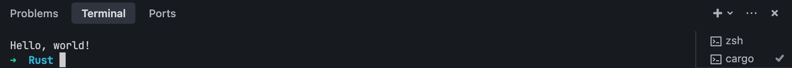

# Introduction
Template for Rust "Hello World!" project.

# Get started
- Click the **Run** button to run the program.
  
- Go to the Terminal panel to view the output.
  

By default, MarsCode provide you with a default running configuration, running main.rs. You can modify it in the **.vscode/launch.json**. Refer to [Visual Studio Code's doc](https://code.visualstudio.com/docs/editor/debugging) for how to configure launch.json.

# Learn more
[rust](https://www.rust-lang.org/learn) - learn about Rust Programming.

# Help
If you need help, you might be able to find an answer in our [docs](https://docs.marscode.com/). Feel free to report bugs and give us feedback [here](https://discord.gg/qtVMXEDbRw).